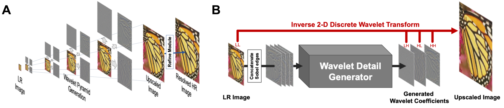

# Team *kaws* solution for the NTIRE2020 extreme super-resolution challenge


## How-to
Reproduce the final results:

1. Download the [pre-trained model](https://www.dropbox.com/s/9ih96r56bs9c6oz/pretrained_model.zip?dl=0) and extract it in the git path
2. Run the following code with path_to_images indicating LR images to resolve

  ```shell
  python main.py --skip_train --test_image path_to_images
  ```

3. Resolved images can be found at result/kaws-ntire2020/summary/test

Train from scratch:

1. Download the [training related data](https://www.dropbox.com/s/xcz2yty7ukp25bg/kaws_train_cache.zip?dl=0) and extract it in the git path
2. Run the following code.

  ```shell
  python main.py
  ```

  Command-line options can be listed by running the main script with -h flag.

  ```shell
  python main.py -h
  ```


## Requirements
- python 3.6
- tensorflow >= 1.14
- tqdm
- python-telegram-bot (optional)

## Concept
Wavelet Pyramid Generation based High-frequency Recovery for Perceptual Extreme Super-Resolution



## Contact
<egyptdj@kaist.ac.kr>
